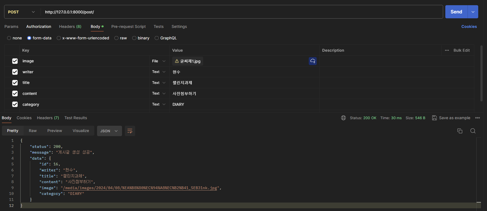

# HyeonSu-Jung

   
안녕하세요. 백엔드 파트 정현수입니다 0.<

      
---
   
## 3주차 스탠다드 과제
### postman 스크린샷 첨부

   
   
## 3주차 챌린지 과제
### https://127.0.0.1:8000/page

    
    
---
   
## 4주차 스탠다드 과제
### ERD

   
### admin 스크린샷

   

## 4주차 챌린지 과제
### 해시태그

---

## 5주차 스탠다드 과제
### 특정 post에 포함된 모든 comment 읽어오는 API 만들기

### created_at 필드 이용하여 4/4~4/10 동안 생성된 post 가져오는 API 만들기

## 5주차 챌린지 과제
### ImageField를 이용하여 이미지를 포함한 post를 생성하는 API 만들기

---

## 6주차 스탠다드 과제
### 배포한 서버에서 로그 확인해보기

---

## 7주차 스탠다드 과제
### comment API

## 7주차 챌린지 과제
### GenericAPIView
### post API
PostList

PostDetail

### Swagger

---
## 8주차 스탠다드 과제

